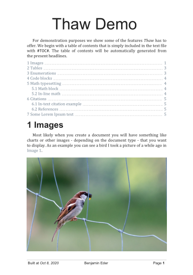

# Thaw

*Thaw* is a tool to create documents with export to **PDF** in a *text-concentrated* working style.
It offers a *feature-rich* and *easy to learn* **markup language** that you can write your documents in a human-readable way.

> Thaw is a prototype of a document layout engine and currently no more maintained.
> The successor **Letter** can be found at https://github.com/bennyboer/letter and is under active development.

## Motivation

Current modern alternatives to TeX/LaTeX and its derivatives include WYSIWYG editors like DTP software that are usually *very expensive* (InDesign), *hard to learn* (LaTeX/TeX) or *human-readable* formats like Markdown that lack a lot of features (Math typesetting, Captions, ...).
We want to improve the situation by proposing *Thaw* which lets you write your documents in a *distraction-free* and *human-readable* way while at the same time being *easy to learn*.

Since Thaw documents only consist of simple text files (except from images) you'll have no problems using Git or another version control software to version your document.


## Example

Usually a Thaw document is defined by three files:
- A text file (ending with `*.tdt`) - *in some ways similar to Markdown* - where you define the contents (text) of the document
- A style file (ending with `*.tds`) - *very similar to CSS* - where you define the style of the document (page size, colors, fonts, ...)
- A info file (ending with `*.tdi`) - *a properties file* - where you define the encoding of the project files, a bibliography to use, citation style, variables, ...

In the following we want to show some code snippets as well as the result taken from the [Demo example](example/demo/demo.pdf) in this repository under `example/demo`.
Running the CLI with gradle (An executable version should be downloadable from the [Releases](https://github.com/bennyboer/thaw/releases) page once there is a release) using the demo example files with `./gradlew.bat :cli:run --args="--root-folder='../example/demo' --output='../example/demo/demo.pdf'"`, we get the following PDF (Only a screenshot shown):



Check out the full PDF [here](example/demo/demo.pdf).


### Info file

The info file defines some info about the document. 

```
encoding = UTF-8
language = en

bibliography.file = literature.bib
bibliography.style = apa

var.version = v0.1
var.author = Benjamin Eder
```

### Style file

The style file is used to alter the document looks to your needs.

```css
document {
	font-family: Cambria;
	inline-code-font-family: Consolas;

	font-size: 13pt;
	color: #222222;

	width: 210mm;
	height: 297mm;

	margin: 2cm 3cm;
}

/* ... */
```

### Text file

The text file defines the contents and the structure of the document.

```
#TITLE# Thaw Demo

For demonstration purposes we show some of the features *Thaw* has to offer.
We begin with a table of contents that is simply included in the text file with `#TOC#`.
The table of contents will be automatically generated from the present headlines.

#TOC#

#H1# Images

Most likely when you create a document you will have something like charts or other images - depending on the document type - that you want to display.
As an example you can see a bird I took a picture of a while ago in #REF, bird-image, prefix=Image#.

#IMAGE,
src="res/bird.jpg",
caption="This is an image of a bird. I don't know which kind, since I am hardly an ornithologist. But it is fun to take pictures of those animals!",
label=bird-image
#

...
```


## Documentation

We are currently trying to establish a documentation for the project that specifies all available features and how to use them.
In the meantime you can check out the demo example project at `example/demo`.


## Contributing

I'd be glad if you want to contribute to the project.
If you're interested write a message to me via email (See my [GitHub profile](https://github.com/bennyboer)).


## Project structure

The project is organized in multiple modules that each take care of a specific part of the application:

| Module name | Folder | Description |
| --- | --- | --- |
| CLI | `/cli` | Command-line interface for the Thaw project |
| Core | `/core` | The core module containing the document model. |
| Text | `/text` | Text file parsing and model. |
| Style | `/style` | Style file parsing and model. |
| Reference | `/reference` | Reference file parsing and model. |
| Info | `/info` | Document information (meta data, etc.) and model. |
| Typesetting | `/typeset` | Code related to typesetting a document. |
| Export | `/export` | Related to exporting a document (for example to PDF). |
| Font | `/font` | Helps dealing with fonts. |
| Hyphenation | `/hyphenation` | Module dealing with hyphenating individual words. |
| Plugin | `/plugin` | Plugin development resources. |
| Shared | `/shared` | Some shared classes. |
| Math | `/math` | LaTeX to MathML converter + MathML typesetting. |
| Util | `/util` | Some useful module-spanning utilities. |
| Code | `/code` | Dealing with syntax highlighting code. |
| Table | `/table` | Table-related logic (Table model dealing with cell spans). |
