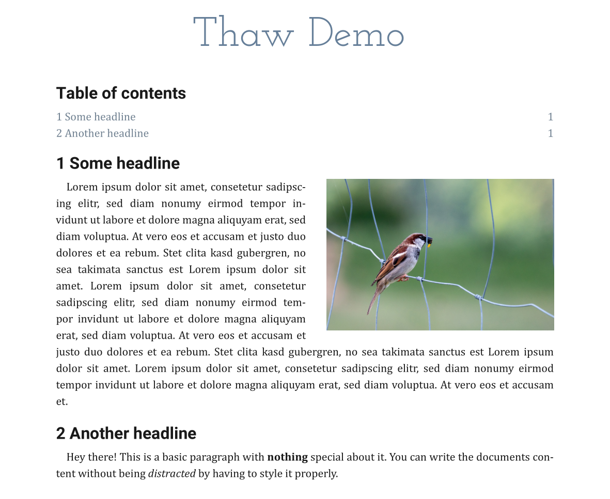

# Thaw

*Thaw* is an hierarchical organizable and perfectly versionable document framework with an export to PDF.

> Note that this software is currently under heavy development and thus cannot not be considered stable software and neither is very well documented yet.

## Motivation

Current modern alternatives to TeX/LaTeX and its derivatives include WYSIWYG editors like DTP software which is usually very expensive (Adobe InDesign) or human-readable formats like Markdown that lack a lot of features.
We want to improve the situation by proposing *Thaw* which lets you organize your documents in a human-readable way while being easy to learn and use as well as being suitable for version control software like Git.


## Example

A Thaw document is defined by four files: **Text**, **Style**, **Info** and **References**.
We've prepared an example using the below file contents (shown here only in extracts).
Running the CLI with gradle (later an executable version will be provided) using the files with `./gradlew.bat :cli:run --args="--root-folder='C:\test' --output='C:\test.pdf'"`we get the following PDF:



### Info file

The info file defines some info about the document. 

```
encoding = UTF-8
language = en

author.name = Benjamin Eder
```

### Style file

The style file is used to alter the document looks.

```json
{
  "DOCUMENT": {
    "size": {
	  "width": 210,
	  "height": 297
    },
	"insets": {
	  "top": 20,
	  "bottom": 20,
	  "left": 20,
	  "right": 20
	},
    ...
  },
  ...
}
```

### Text file

The text file defines the contents and the structure of the document.

```
#TITLE# Thaw Demo


#H1, numbered=false# Table of contents

#TOC#


#H1, label=headline1# Some headline

#IMAGE, src=C:/Users/beder/Downloads/test/bird.jpg, float=true, width=220, alignment=RIGHT, label=bird#

Lorem ipsum dolor sit amet, consetetur sadipscing elitr, sed diam nonumy eirmod tempor invidunt ut labore et dolore magna aliquyam erat, sed diam voluptua.
At vero eos et accusam et justo duo dolores et ea rebum. Stet clita kasd gubergren, no sea takimata sanctus est Lorem ipsum dolor sit amet.
Lorem ipsum dolor sit amet, consetetur sadipscing elitr, sed diam nonumy eirmod tempor invidunt ut labore et dolore magna aliquyam erat, sed diam voluptua.
At vero eos et accusam et justo duo dolores et ea rebum. Stet clita kasd gubergren, no sea takimata sanctus est Lorem ipsum dolor sit amet.
Lorem ipsum dolor sit amet, consetetur sadipscing elitr, sed diam nonumy eirmod tempor invidunt ut labore et dolore magna aliquyam erat, sed diam voluptua.
At vero eos et accusam et.

#H1, label=another-headline# Another headline

Hey there! This is a basic paragraph with **nothing** special about it.
You can write the documents content without being *distracted* by having to style it properly.
```


## Project structure

The project is organized in multiple modules:

| Module name | Folder | Description |
| --- | --- | --- |
| CLI | `/cli` | Command-line interface for the Thaw project |
| Core | `/core` | The core module containing the document model. |
| Text | `/text` | Text file parsing and model. |
| Style | `/style` | Style file parsing and model. |
| Reference | `/reference` | Reference file parsing and model. |
| Info | `/info` | Document information (meta data, etc.) and model. |
| Typesetting | `/typeset` | Code related to typesetting a document. |
| Export | `/export` | Related to exporting a document (for example to PDF). |
| Font | `/font` | Helps dealing with fonts. |
| Hyphenation | `/hyphenation` | Module dealing with hyphenating individual words. |
| Plugin | `/plugin` | Plugin development resources. |
| Shared | `/shared` | Some shared classes. |
